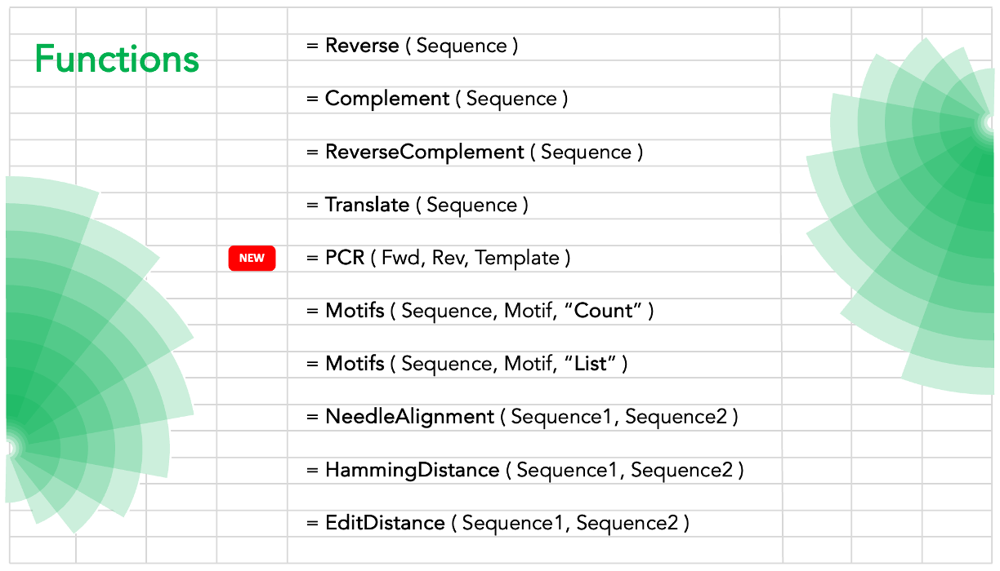
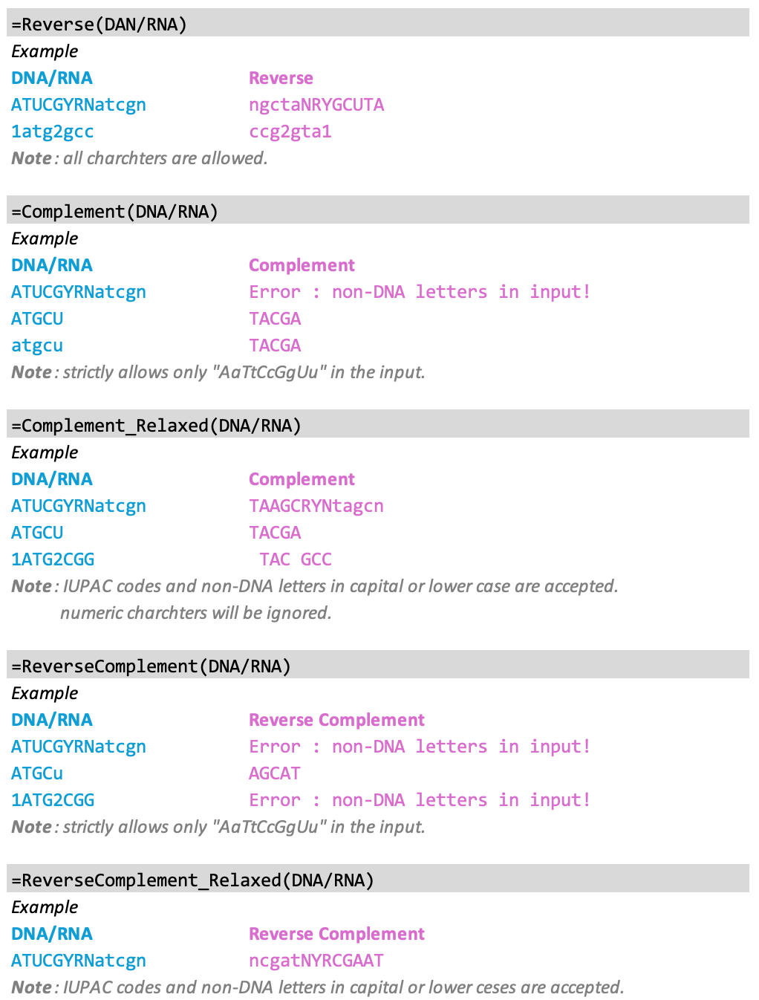
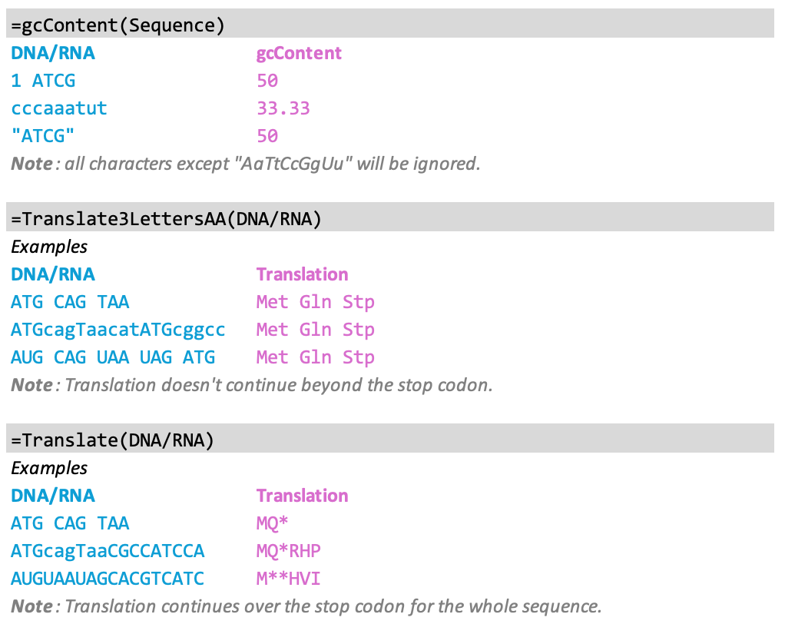
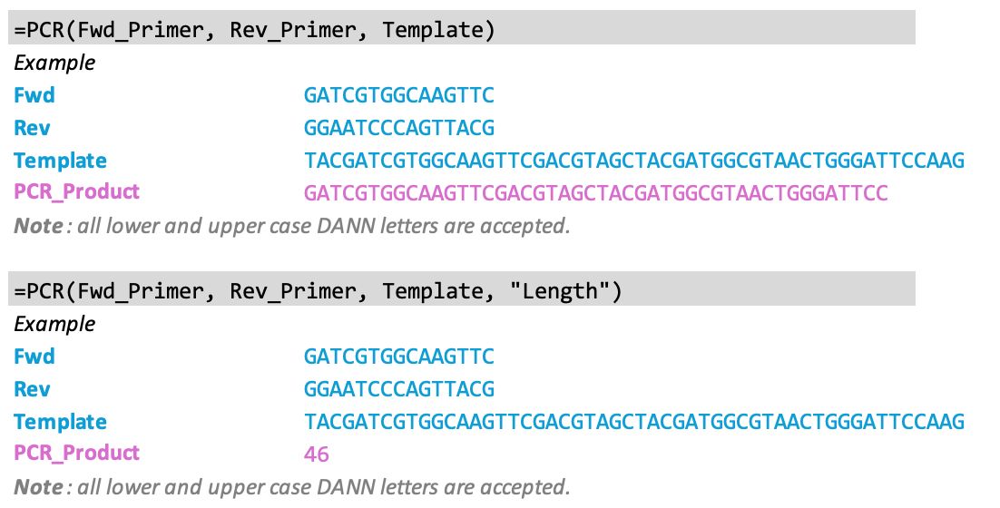
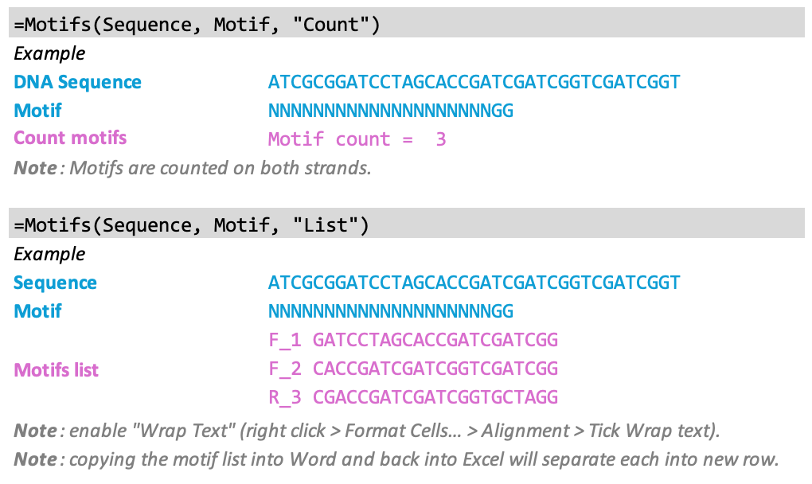
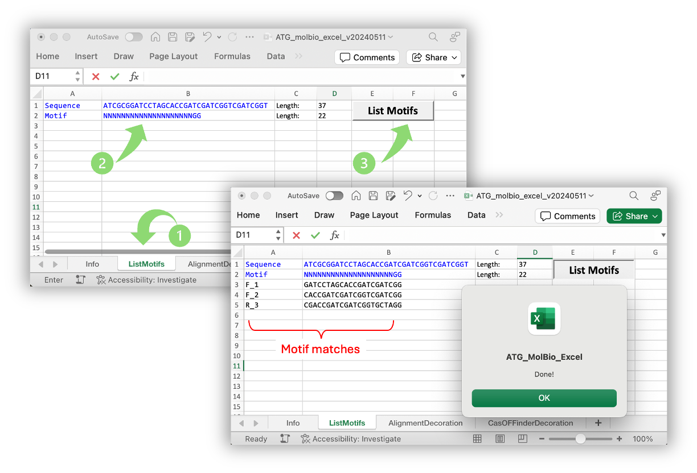
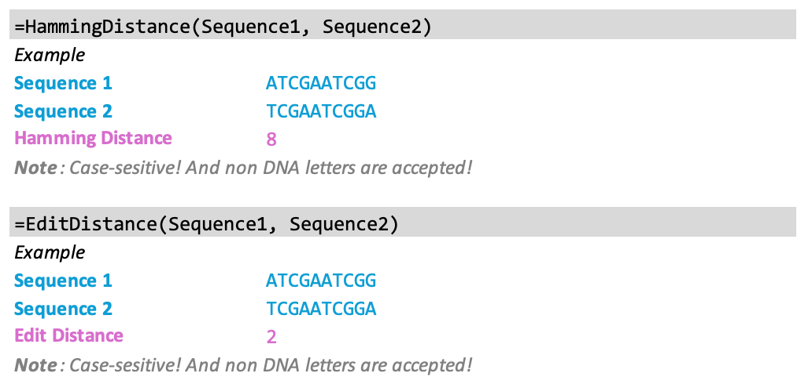
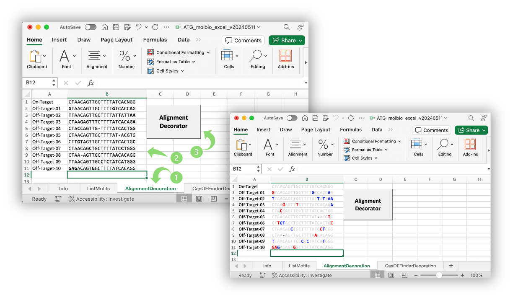
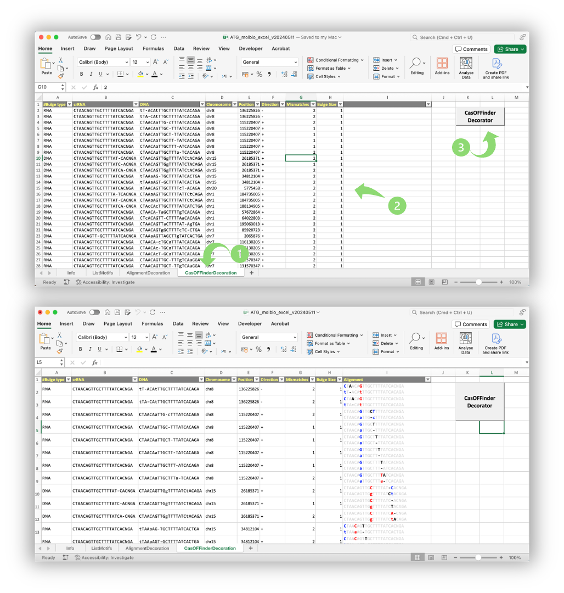
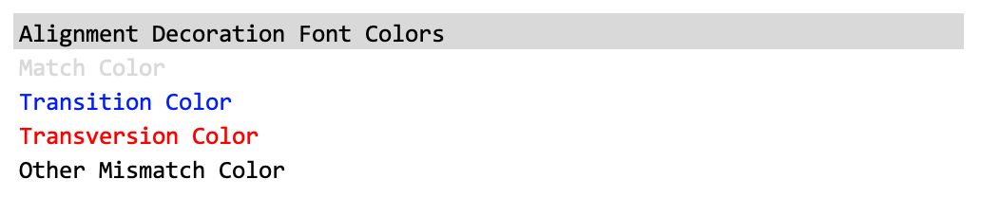

# ATG_molbio_excel


Excel VBA (Visual Basic for Applications) is a powerful feature of Microsoft Excel to extend its functionality  and automate tasks. This repository contains codes that add Molecular Biology related functionalities to Excel.

## Excel file
Simply download "ATG_molbio_excel.xlsb" file and enable the Macros upon opening. Tested on a Mac system, no reason for not working on Windows systems.

## Usage
* **Basic functions**: Reverse, Complement, ReverseComplement, gcContent, and Translate:

```
=Reverse(DAN/RNA)	

=Complement(DNA/RNA)
=Complement_Relaxed(DNA/RNA)

=ReverseComplement(DNA/RNA)
=ReverseComplement_Relaxed(DNA/RNA)

=gcContent(DNA/RNA)

=Translate3LettersAA(DNA/RNA)
=Translate(DNA/RNA)

```




 * **PCR**: to produce the sequence of an amplicon using Fwd, Rev, and Template sequences as input:

```
=PCR(Fwd, Rev, Template)	
=PCR(Fwd, Rev, Template, "Length")	

```




* **Needleman alignment**: Aligns two sequences using the [Needleman-Wunch alignment algorithm](https://en.wikipedia.org/wiki/Needleman%E2%80%93Wunsch_algorithm). 

```
=NeedleAlignmnet(Sequence1,Sequence2)
```


* **Motif Search**: Count the number or list motifs in a sequence (searching both strands). This feature, for example, can be used for listing all targetable SpyCas9 (NNNNNNNNNNNNNNNNNNNN**NGG**), or AspCas12a (**TTTN**NNNNNNNNNNNNNNNNNNNNN) sites:

```
=Motifs(Sequence, Motif, "Count")
=Motifs(Sequence, Motif, "List")
```


Alternatively, "**ListMotifs**" worksheet is specifically designed to provide a clickable button to find matching motifs in a sequence and list them. 



* **Sequence Distances**: Calculate Hamming Distance or Edit Distance (a.k.a. Levenshtine Distance) between two sequences



* **Alignment Decoration**: Change the font color of mismatches between two sequences based on their nature (Transition, Transversion, indel). Refer to the "Info" sheet to specify the desired font color for matches and mismatches.



* **CasOFFinder Decoration**:  is a computational tool used to find genome-wide off-target candidates for RNA-guided proteins. The designated worksheet runs a Macro to visualize the crRNA and DNA (off-target) differences.



## Important to know
* Non-DNA letters for the "Relaxed" basic functions are accepted (an on-purpose feature).
* Microsoft Excel has a character limit of 32,767 characters in each cell.
* The default parameters for Needleman function are adjustable via the "Info" worksheet.
* Font colors for Matches and different type of Mismatches are adjustable by changing the font color of designated cells in the "Info" worksheet.



## Contact
Please report bugs to Amir.Taheri.Ghahfarokhi@Gmail.com
