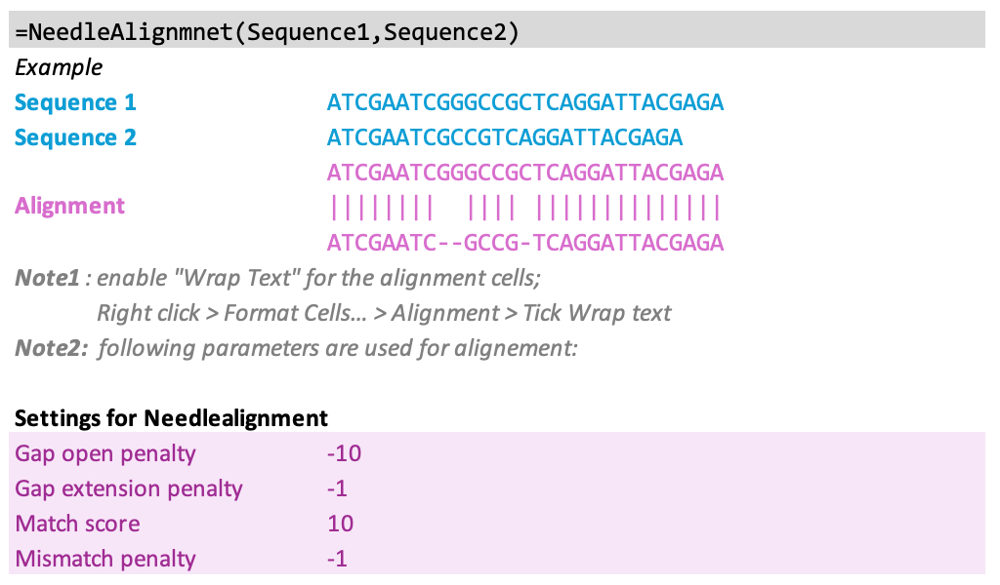

# ATG_molbio_excel
Excel VBA (Visual Basic for Applications) is a powerful feature of Microsoft Excel to automating tasks and extending the functionality of Excel. Can we - Molecular Biologists - unlock its full potential for our every day use whem it comes to handling sequences in Excel?

## Excel file
Simply download "ATG_molbio_excel.xlsb" file and enable the Macros upon openings.

## Usage
* **Basic functions**: Reverse, Complement, ReverseComplement, and Translate.

```
=Reverse(DAN/RNA)	
=Complement(DNA/RNA)
=ReverseComplement(DNA/RNA)
=Translate3LettersAA(DNA/RNA)
=Translate(DNA/RNA)
```


* **Needleman alignment**: Now you can easily align two sequences in Excel using the Needleman-Wunch alignment algorithm. 

```
=NeedleAlignmnet(Sequence1,Sequence2)
```



* **Motif Search**: Count the number of motifs in a sequence (searching both strands), and listing the motifs. This feature, for example, can be used for listing all targetable SpyCas9 (`20N-NGG`), or AspCas12a (`TTTN-20N`) sites:

```
=Motifs(Sequence, Motif, "Count")
=Motifs(Sequence, Motif, "List")
```


## Important to know
* Non-DNA letters for basic functions are accepted (an on-purpose feature).
* Microsoft Excel has a character limit of 32,767 characters in each cell.
* The following deault parameters are hard coded in the Needleman function: `Gap penalty = -5`, `MisMatch penalty = -1`, `Match = 10`,  `Extended gap penalty = -1`.

## Contact
Please report bugs to Amir.Taheri.Ghahfarokhi@Gmail.com
